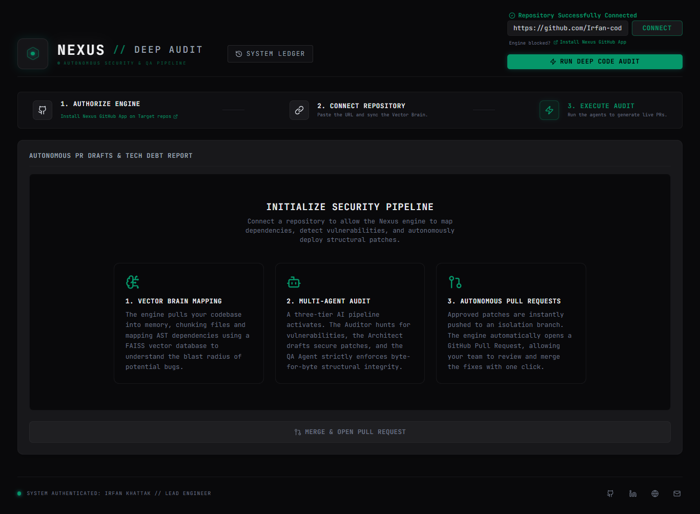
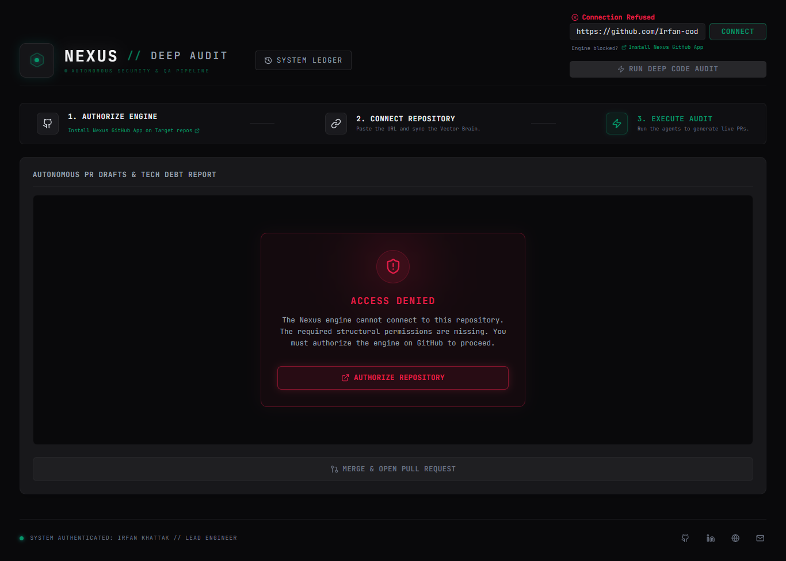
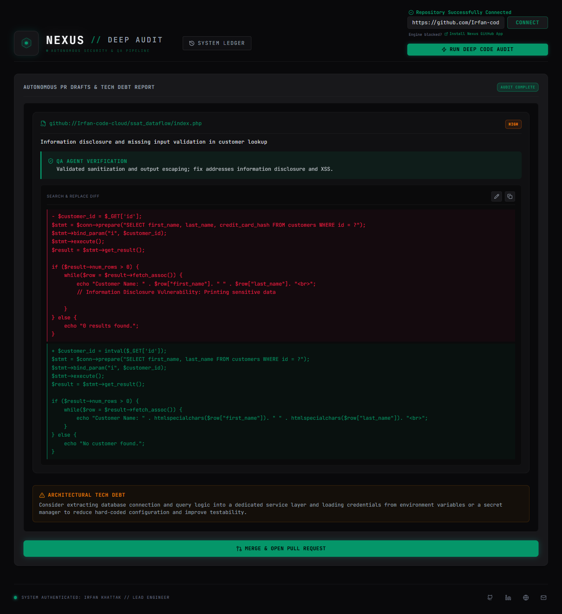
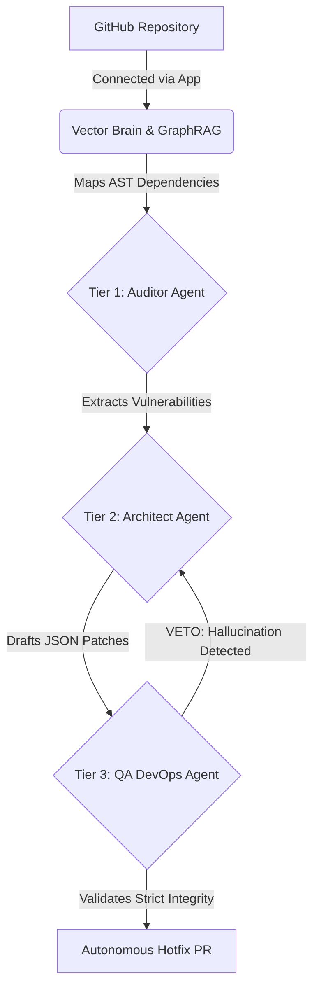
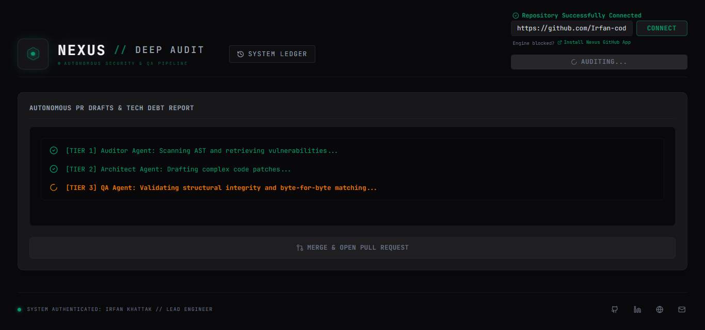
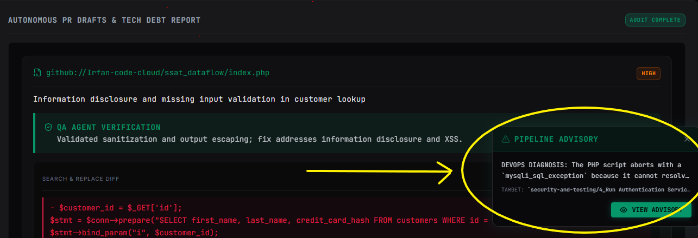
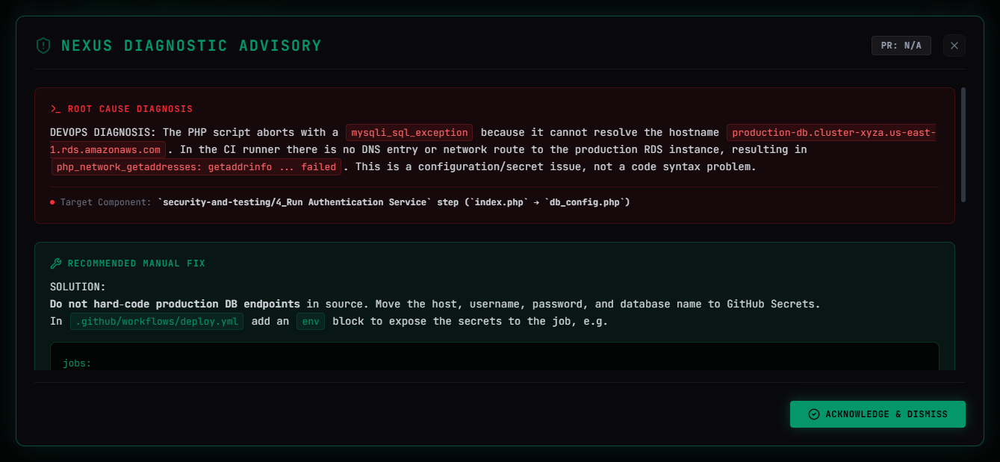
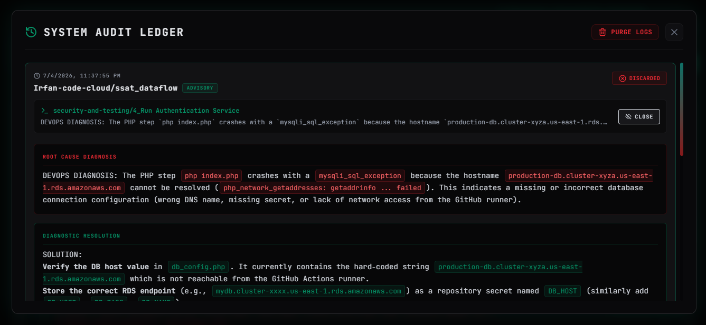

# 🦇 NEXUS Deep Audit Engine

**An Autonomous Security & QA Orchestration Pipeline**

NEXUS is an enterprise-grade, multi-agent AI pipeline designed to ingest, map, audit, and autonomously patch complex codebases. Designed for the **Agents for Business** track, it transforms the traditional CI/CD security bottleneck into a continuous, self-healing workflow.


<br><br>
*The Nexus Command Center: A high-tech, tactical interface for initializing the vector brain mapping, multi-agent audit, and autonomous PR pipeline.*

<br>


<br><br>
*Authorization Gate: If the GitHub App is not installed, this notification will appear. Users can click the authorize button to be redirected to the GitHub App installation page, where they can install and select repositories for the engine to access.*

---

## 🛑 The Business Problem
Enterprise software teams face a critical operational bottleneck: deployment failures and security vulnerabilities drain engineering resources. When a CI/CD pipeline crashes, DevOps engineers waste countless hours sifting through thousands of lines of cryptic GitHub workflow logs just to track down a missing environment variable, a broken DNS route, or a cross-language syntax error. 

Furthermore, manual pull request reviews frequently miss architectural tech debt. Forcing senior talent to pause revenue-generating feature development to hunt down logs and deploy manual hotfixes results in delayed releases, extended downtime, and burned-out engineering teams.

## 💡 The Solution
NEXUS transforms this bottleneck into a continuous, self-healing workflow, reducing pipeline debugging and vulnerability patching time from hours to mere seconds. Operating as an autonomous DevSecOps engineer, Nexus integrates directly into your GitHub ecosystem to deliver two core enterprise capabilities:

* **Instant CI/CD Pipeline Diagnostics:** When a GitHub Action workflow fails, Nexus automatically intercepts and reads the raw error logs. It instantly isolates the root cause and generates a precise "DevOps Advisory," providing human engineers with an exact, step-by-step resolution plan (e.g., exactly which GitHub Secret to add or which configuration to change).
* **Autonomous Self-Healing Code:** The engine maps internal code dependencies using a FAISS (Facebook AI Similarity Search) vector brain to understand the "Blast Radius" of any change. It flags critical vulnerabilities and generates byte-for-byte exact code replacements. Finally, it autonomously pushes a secure hotfix branch and opens a Pull Request for human approval requiring zero manual coding.


<br><br>
*Autonomous Patching: The QA Agent verifies the Architect's code generation, providing a precise search-and-replace diff ready for a one-click pull request.*

---

## 🏗️ Technical Architecture & Agent Roles



The engine leverages a highly structured, multi-agent workflow orchestrated via FastAPI (Backend) and React (Frontend).


<br><br>
*Live Agent Tracking: The dashboard visualizes the sequential pipeline in real-time as agents scan AST, draft patches, and validate structural integrity.*


1. **The Vector Brain (GraphRAG):**
   When a repository is connected, the engine clones it into memory and chunks the Abstract Syntax Tree (AST). It maps file dependencies to understand the "Blast Radius" of any potential code change, storing this context in a local FAISS vector database powered by Google's Gemini Embeddings.

2. **Tier 1: The Auditor Agent:**
   Scans the vectorized codebase against known vulnerability patterns, technical debt markers, and simulated MCP Server ingestion logs (Crash logs, Zendesk tickets). It extracts high-risk fragments and their import dependencies.

3. **Tier 2: The Architect Agent (Powered by Groq/Llama):**
   Analyzes the fragments and drafts a JSON blueprint. It generates precise `search_block` and `replace_block` payloads to fix the vulnerabilities.

4. **Tier 3: The QA Agent:**
   The adversarial safety net. It strictly enforces domain isolation (preventing cross-language hallucinations like suggesting Python code in a JS file) and validates byte-for-byte accuracy. If the Architect hallucinates, the QA Agent invokes a "VETO" and aborts the patch.

### 🏆 Kaggle Course Concepts Demonstrated
* **Agent/Multiagent System:** A strict 3-tier sequential pipeline (Auditor -> Architect -> QA).
* **Security Features:** The system is explicitly designed for vulnerability patching, featuring a "Scorched Earth Protocol" that detects exposed secrets and aggressively redacts them before proposing a patch.
* **MCP Server Integration:** Simulates ingestion of cross-platform production signals (Sentry logs, App Store reviews) to target the audit.

---

## 🧠 Advanced Capabilities

### DevOps Advisory & Root Cause Analysis
Beyond syntax errors, Nexus diagnoses systemic infrastructure and configuration failures. When system fails it gives an notification with root cause and solution.


<br><br>


<br><br>

*When a script crashes due to unreachable endpoints, the engine identifies the root cause (e.g., DNS failures from a GitHub Actions runner) and provides a concrete manual fix, such as migrating hard-coded endpoints to GitHub Secrets.*

### System Ledger

<br><br>
*The immutable System Ledger tracks all historic audits, discarded drafts, and deployed PRs, ensuring total accountability for all AI actions.*

---

### 2. The Repository Structure Tree

```markdown
Nexus-Audit-Engine/
├── .env
├── README.md
├── assets/
│   └── (Dashboard UI Screenshots)
├── frontend/
│   └── src/
│       ├── App.jsx
│       ├── AuditHistoryModal.jsx
│       ├── RollbackModal.jsx
│       ├── main.jsx
│       ├── App.css
│       └── index.css
└── backend/
    ├── main.py
    ├── auth_engine.py
    ├── requirements.txt
    └── agents/
        ├── dependency_mapper.py
        ├── pr_agent.py
        └── vector_brain.py
```

## 🚀 Local Setup Instructions (For Judges)

To run the Nexus Engine locally, you will need to set up both the Python backend and the React frontend. 

### Prerequisites
* Python 3.9+
* Node.js & npm
* A GitHub App (for generating dynamic installation tokens)

### 🔑 How to Create a GitHub App for Local Testing
Because this engine uses dynamic, bank-grade installation tokens and real-time webhooks, you must create a quick GitHub App on your account to run it locally:

1. Start your backend server (`uvicorn main:app --reload --port 8000`).
2. In a new terminal window, start ngrok to expose your local port: 
   `ngrok http 8000`
3. Copy your secure `ngrok` forwarding URL (e.g., `https://1234-abcd.ngrok-free.app`).
4. Go to your GitHub **Settings** > **Developer settings** > **GitHub Apps** > **New GitHub App**.
5. **Name:** Nexus-Audit-Test (or similar) & **Homepage URL:** `http://localhost:5173`.
6. **Webhook URL:** Paste your ngrok URL and append the webhook endpoint: 
   `https://<your-ngrok-id>.ngrok-free.app/api/v1/webhooks/github`
7. **Permissions:** Grant `Read & write` access for **Contents** and **Pull requests**.
8. Subscribe to Events: Check the box for **Pull request**.
9. Click **Create GitHub App**.
10. On the next screen, copy your **App ID** (for the `.env` file).
11. Scroll down and click **Generate a private key**. Rename the downloaded file to `batcomputer-private-key.pem` and place it in the `backend/` directory.
12. Finally, click **Install App** in the left sidebar and install it on the repositories you want to audit!

### 1. Clone the Repository
```bash
git clone https://github.com/Irfan-code-cloud/Nexus-Audit-Engine.git
cd Nexus-Audit-Engine
```
gi
### 2. Backend Environment Setup

The backend requires specific API keys and a GitHub App private key to function.
> NOTE: This Project is currenly optimized for windows environment.

```bash
# Navigate to the backend
cd backend

# Create a virtual environment and activate it
python -m venv venv
source venv/bin/activate  # On Windows: venv\Scripts\activate

# Install all project dependencies
pip install -r requirements.txt
```

### Create the .env file: 

Create a file named .env in the root of the backend/ directory and add your keys:

```bash
GITHUB_APP_ID="your_github_app_id"
GITHUB_TOKEN="your_personal_access_token_fallback"
GEMINI_API_KEY="your_google_gemini_api_key"
GROQ_API_KEY="your_groq_api_key"
GITHUB_WEBHOOK_SECRET="your_webhook_secret"
```
### Add the GitHub Private Key:

You must generate a private key `.pem` file from your GitHub App settings. Save this file exactly as `batcomputer-private-key.pem` inside the `backend/` folder (same level as `auth_engine.py`).

### 3. Frontend Environment Setup

Open a new terminal window to start the tactical Batcomputer dashboard.

```bash
# Navigate to the frontend
cd frontend

# Install dependencies
npm install

# Run the development server
npm run dev
```

## 🏁 Usage Guide

1.  **Start the Engine**: Ensure both the backend (`uvicorn main:app --reload`) and frontend (`npm run dev`) servers are running.
2.  **Authorize the Engine**: Before the engine can audit a codebase, you MUST grant it access. Install the GitHub App you created onto the specific repositories you want to scan (you can do this from your GitHub App's settings page by clicking "Install App").
3.  **Connect Repository**: Open the frontend (`http://localhost:5173`). Paste your authorized GitHub repository URL into the connection bar and click **Connect** to sync the Vector Brain.
4.  **Execute Audit**: Once the repository is successfully connected and mapped, click **Run Deep Code Audit** to unleash the multi-agent pipeline.
5.  **Review & Deploy**: The system will process the codebase, identify vulnerabilities, and display the generated code patches. Click **Merge & Open Pull Request** to deploy the surgical fix directly to your GitHub repository.

---

## 🛡️ Security & Architecture

*   **GitHub App Flow**: The system uses dynamic app installation tokens to securely authenticate with repositories without storing long-lived personal access tokens in the code.
*   **Vectorized Context**: The use of FAISS ensures that the LLM has "read" the entire codebase contextually, enabling accurate bug detection across complex directory structures.
*   **Safety Loops**: The QA Agent acts as a final "VETO" authority to prevent AI hallucinations from breaking the build.

## ☁️ Cloud Deployment Architecture

The Nexus Audit Engine operates on a decoupled, microservice architecture to ensure maximum scalability and performance. 

### 1. Frontend: Vercel (The Command Center)
The React/Vite dashboard is deployed on **Vercel**. 
* **Why Vercel?** Vercel provides out-of-the-box global Edge Network distribution, instantly serving the static UI assets to users with near-zero latency. By decoupling the UI from the backend, the React application remains ultra-responsive and doesn't consume the expensive compute resources required by the AI agents. 
* **Integration:** The frontend communicates securely with the cloud backend via injected environment variables (`VITE_API_BASE_URL`).

### 2. Backend: Google Cloud Run (The AI Brain)
The FastAPI AI orchestration layer is deployed as a serverless container on **Google Cloud Run**.
* **Why Google Cloud?** The backend requires heavy lifting: parsing Abstract Syntax Trees, querying FAISS vector databases, and managing long-running LLM generation streams. Google Cloud Run provides secure secret management (for Groq and GitHub keys) and auto-scales compute resources seamlessly when multiple webhooks or audit requests arrive simultaneously.

### 3. Containerization (Docker)
The backend is strictly containerized using the included `Dockerfile`.
* **Why Docker?** Machine learning dependencies and vector databases (like FAISS) are highly sensitive to operating system environments. By utilizing a Linux-based Docker container, we completely eliminate the "it works on my machine" problem. 
* **How it works:** The `Dockerfile` pulls a verified Python 3.11 image, installs exact OS-level dependencies, installs the isolated Python packages via `requirements_linux.txt`, and securely exposes the application to Google Cloud Run via dynamic port mapping.

---

### ENGINEER

**Engineered by Irfan Khattak - AI Orchestration Engineer** 
